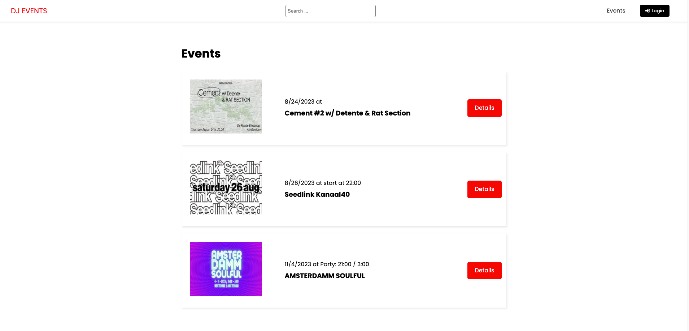
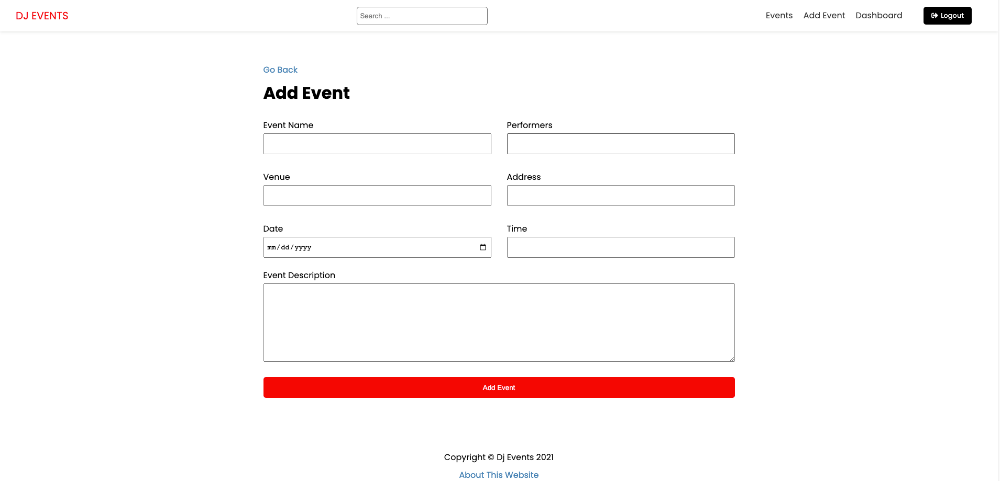

# dj events - Frontend

Dj events screenshot

## Table of Contents

- [Description](#description)
- [Getting Started](#getting-started)
- [Technologies](#technologies)

## Description

Welcome to the frontend repository of the Music Events Application, built using Next.js. This project is part of a comprehensive course I took, focused on developing applications with Next.js and integrating them with Strapi backend. In this specific repository, it cover the frontend implementation of the Dj Events Application. The backend repository can be found [here](https://github.com/Supaflava/dj-events-backend).

Key learned points include:

- Implementing pages and managing routing with Next.js.
- Utilizing data fetching methods such as `getServerSideProps`, `getStaticProps`, and `getStaticPaths`.
- Styling components using CSS for enhanced UI/UX.
- Optimizing images to improve loading performance.
- Integrating Cloudinary for seamless image uploads.
- Interacting with backend APIs for data retrieval and updates.
- Implementing user authentication using JSON Web Tokens (JWT).

## Getting Started

To start working with the frontend of the Dj Events Application, follow these steps:

1. Clone this repository: `git clone https://github.com/Supaflava/dj-events`
2. Navigate to the project directory: `cd dj-events-frontend`
3. Install dependencies: `npm install` or `yarn install`
4. Configure the backend: Follow instructions in the [backend repository](https://github.com/Supaflava/dj-events-backend).
5. Start the development server: `npm run dev` or `yarn dev`
6. Access the application at: `http://localhost:3000`

## Technologies

The frontend of the Music Events Application is built using the following technologies:

- Next.js
- React
- JSON Web Tokens (JWT)
- Cloudinary

## Still to be done

While the Dj Events Application has made significant progress, there are a few areas that require attention. Your contributions are welcome in resolving these issues:

- Redirect After User Login: Currently, there's an issue with the redirection after a user successfully logs in. We need to ensure that users are directed to the appropriate page upon successful authentication.

- Image URL Issue: There's an issue related to image URLs in the application. Some images may not be displaying correctly due to incorrect or broken URLs. This needs to be investigated and fixed to ensure a seamless user experience.
